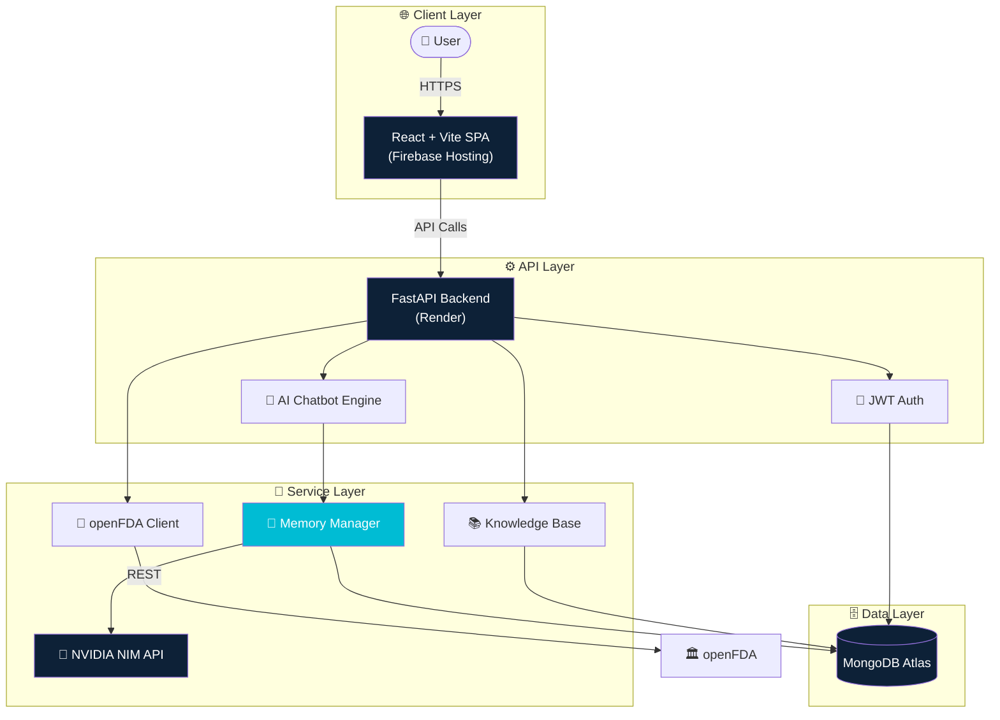
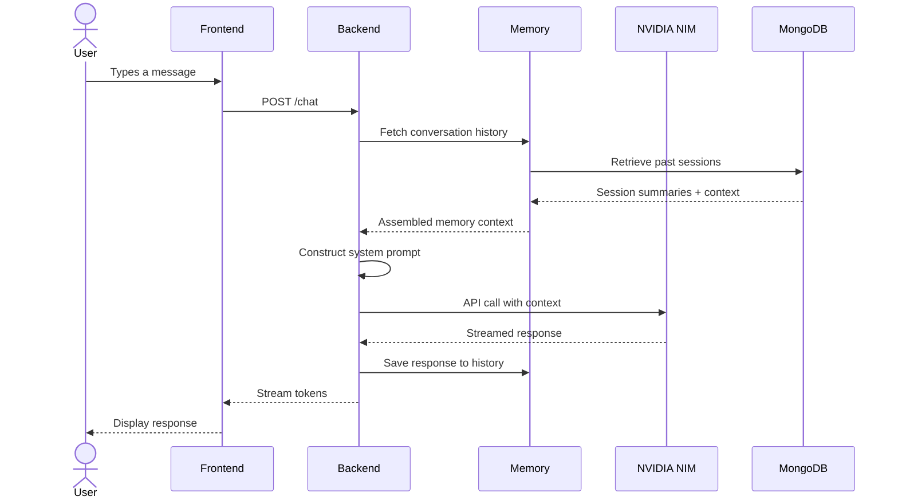
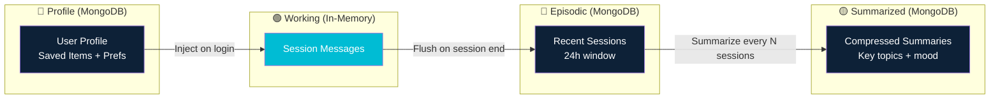
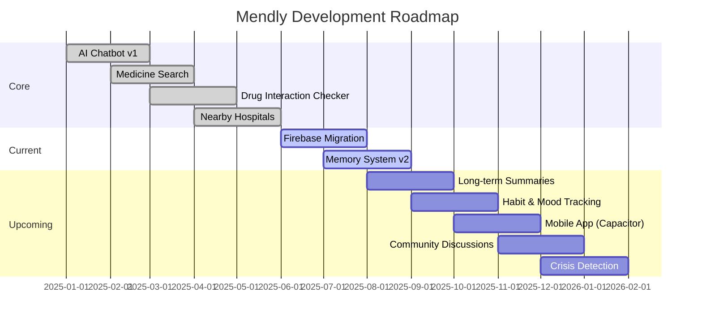
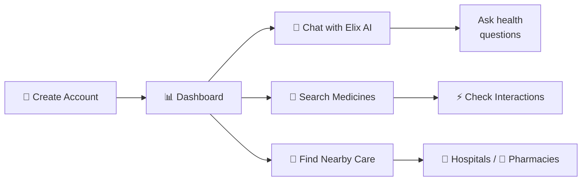
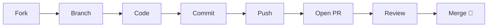

<div align="center">

```svg
<svg xmlns="http://www.w3.org/2000/svg" viewBox="0 0 900 280" width="100%" height="auto">
  <defs>
    <linearGradient id="bgGrad" x1="0%" y1="0%" x2="100%" y2="100%">
      <stop offset="0%" stop-color="#0a1628"/>
      <stop offset="50%" stop-color="#0d2137"/>
      <stop offset="100%" stop-color="#00bcd4"/>
    </linearGradient>
    <linearGradient id="wave1g" x1="0%" y1="0%" x2="100%" y2="0%">
      <stop offset="0%" stop-color="rgba(0,188,212,0)" />
      <stop offset="30%" stop-color="rgba(0,188,212,0.3)" />
      <stop offset="70%" stop-color="rgba(0,188,212,0.3)" />
      <stop offset="100%" stop-color="rgba(0,188,212,0)" />
    </linearGradient>
    <linearGradient id="wave2g" x1="0%" y1="0%" x2="100%" y2="0%">
      <stop offset="0%" stop-color="rgba(0,188,212,0)" />
      <stop offset="25%" stop-color="rgba(128,222,234,0.25)" />
      <stop offset="75%" stop-color="rgba(128,222,234,0.25)" />
      <stop offset="100%" stop-color="rgba(0,188,212,0)" />
    </linearGradient>
    <linearGradient id="wave3g" x1="0%" y1="0%" x2="100%" y2="0%">
      <stop offset="0%" stop-color="rgba(0,188,212,0)" />
      <stop offset="20%" stop-color="rgba(0,131,143,0.2)" />
      <stop offset="80%" stop-color="rgba(0,131,143,0.2)" />
      <stop offset="100%" stop-color="rgba(0,188,212,0)" />
    </linearGradient>
    <filter id="glow">
      <feGaussianBlur stdDeviation="3" result="blur"/>
      <feMerge><feMergeNode in="blur"/><feMergeNode in="SourceGraphic"/></feMerge>
    </filter>
  </defs>

  <!-- Background -->
  <rect width="900" height="280" fill="url(#bgGrad)" rx="16"/>

  <!-- Wave 1 - deep slow wave -->
  <path d="M-100,220 Q-20,180 60,220 T220,220 T380,220 T540,220 T700,220 T860,220 T1020,220 L1020,280 L-100,280 Z"
        fill="url(#wave1g)" opacity="0.5">
    <animateTransform attributeName="transform" type="translate"
      values="0,0; -200,0; -400,0; -200,0; 0,0"
      dur="12s" repeatCount="indefinite"/>
  </path>

  <!-- Wave 2 - medium wave -->
  <path d="M-100,230 Q30,195 160,230 T420,230 T680,230 T940,230 L940,280 L-100,280 Z"
        fill="url(#wave2g)" opacity="0.4">
    <animateTransform attributeName="transform" type="translate"
      values="0,0; 180,0; 360,0; 180,0; 0,0"
      dur="10s" repeatCount="indefinite"/>
  </path>

  <!-- Wave 3 - fast shallow wave -->
  <path d="M-100,240 Q10,218 120,240 T340,240 T560,240 T780,240 T1000,240 L1000,280 L-100,280 Z"
        fill="url(#wave3g)" opacity="0.6">
    <animateTransform attributeName="transform" type="translate"
      values="0,0; -120,0; -240,0; -120,0; 0,0"
      dur="7s" repeatCount="indefinite"/>
  </path>

  <!-- Wave 4 - accent ripple -->
  <path d="M-100,255 Q40,238 180,255 T500,255 T820,255 T1140,255 L1140,280 L-100,280 Z"
        fill="rgba(0,188,212,0.15)">
    <animateTransform attributeName="transform" type="translate"
      values="0,0; 250,0; 500,0; 250,0; 0,0"
      dur="15s" repeatCount="indefinite"/>
  </path>

  <!-- Particles / bubbles -->
  <circle cx="150" cy="160" r="2" fill="rgba(0,188,212,0.6)">
    <animate attributeName="cy" values="160;140;160" dur="4s" repeatCount="indefinite"/>
    <animate attributeName="opacity" values="0.6;0.2;0.6" dur="4s" repeatCount="indefinite"/>
  </circle>
  <circle cx="400" cy="180" r="1.5" fill="rgba(128,222,234,0.5)">
    <animate attributeName="cy" values="180;155;180" dur="3.5s" repeatCount="indefinite"/>
    <animate attributeName="opacity" values="0.5;0.1;0.5" dur="3.5s" repeatCount="indefinite"/>
  </circle>
  <circle cx="650" cy="170" r="2.5" fill="rgba(0,188,212,0.4)">
    <animate attributeName="cy" values="170;145;170" dur="5s" repeatCount="indefinite"/>
    <animate attributeName="opacity" values="0.4;0.1;0.4" dur="5s" repeatCount="indefinite"/>
  </circle>
  <circle cx="280" cy="140" r="1" fill="rgba(128,222,234,0.7)">
    <animate attributeName="cy" values="140;125;140" dur="3s" repeatCount="indefinite"/>
  </circle>
  <circle cx="520" cy="150" r="1.8" fill="rgba(0,188,212,0.5)">
    <animate attributeName="cy" values="150;130;150" dur="4.5s" repeatCount="indefinite"/>
    <animate attributeName="opacity" values="0.5;0.15;0.5" dur="4.5s" repeatCount="indefinite"/>
  </circle>
  <circle cx="760" cy="165" r="1.2" fill="rgba(0,188,212,0.6)">
    <animate attributeName="cy" values="165;148;165" dur="3.8s" repeatCount="indefinite"/>
  </circle>

  <!-- Logo icon -->
  <text x="450" y="100" font-family="Arial, sans-serif" font-size="32" fill="rgba(0,188,212,0.3)" text-anchor="middle" dominant-baseline="middle">✦</text>

  <!-- Title -->
  <text x="450" y="115" font-family="'Segoe UI', Arial, sans-serif" font-size="58" font-weight="800" fill="#ffffff" text-anchor="middle" dominant-baseline="middle" filter="url(#glow)" letter-spacing="2">
    Mendly
    <animate attributeName="opacity" values="1;0.85;1" dur="3s" repeatCount="indefinite"/>
  </text>

  <!-- Tagline -->
  <text x="450" y="160" font-family="'Segoe UI', Arial, sans-serif" font-size="16" fill="rgba(255,255,255,0.7)" text-anchor="middle" dominant-baseline="middle" letter-spacing="4">
    AI · Medical · Companion
  </text>

  <!-- Accent line -->
  <line x1="350" y1="178" x2="550" y2="178" stroke="rgba(0,188,212,0.5)" stroke-width="1">
    <animate attributeName="opacity" values="0.5;0.2;0.5" dur="2s" repeatCount="indefinite"/>
  </line>

  <!-- Badge strip -->
  <rect x="200" y="200" width="500" height="50" rx="25" fill="rgba(0,0,0,0.3)" stroke="rgba(0,188,212,0.2)" stroke-width="1"/>
  <text x="240" y="228" font-family="Arial, sans-serif" font-size="12" fill="rgba(255,255,255,0.8)" text-anchor="middle">⚕️</text>
  <text x="300" y="228" font-family="Arial, sans-serif" font-size="12" fill="rgba(255,255,255,0.8)" text-anchor="middle">💊</text>
  <text x="345" y="228" font-family="Arial, sans-serif" font-size="12" fill="rgba(255,255,255,0.8)" text-anchor="middle">🧠</text>
  <text x="390" y="228" font-family="Arial, sans-serif" font-size="12" fill="rgba(255,255,255,0.8)" text-anchor="middle">⚡</text>
  <text x="435" y="228" font-family="Arial, sans-serif" font-size="12" fill="rgba(255,255,255,0.8)" text-anchor="middle">🆘</text>
  <text x="480" y="228" font-family="Arial, sans-serif" font-size="12" fill="rgba(255,255,255,0.8)" text-anchor="middle">📍</text>
  <text x="525" y="228" font-family="Arial, sans-serif" font-size="12" fill="rgba(255,255,255,0.8)" text-anchor="middle">🌓</text>
  <text x="570" y="228" font-family="Arial, sans-serif" font-size="12" fill="rgba(255,255,255,0.8)" text-anchor="middle">🔖</text>
  <text x="660" y="228" font-family="Arial, sans-serif" font-size="11" fill="rgba(0,188,212,0.6)" text-anchor="middle">v1.0</text>

  <!-- Badge labels -->
  <text x="240" y="242" font-family="Arial, sans-serif" font-size="7" fill="rgba(255,255,255,0.4)" text-anchor="middle">AI Chat</text>
  <text x="300" y="242" font-family="Arial, sans-serif" font-size="7" fill="rgba(255,255,255,0.4)" text-anchor="middle">Medicines</text>
  <text x="345" y="242" font-family="Arial, sans-serif" font-size="7" fill="rgba(255,255,255,0.4)" text-anchor="middle">Conditions</text>
  <text x="390" y="242" font-family="Arial, sans-serif" font-size="7" fill="rgba(255,255,255,0.4)" text-anchor="middle">Interactions</text>
  <text x="435" y="242" font-family="Arial, sans-serif" font-size="7" fill="rgba(255,255,255,0.4)" text-anchor="middle">Emergency</text>
  <text x="480" y="242" font-family="Arial, sans-serif" font-size="7" fill="rgba(255,255,255,0.4)" text-anchor="middle">Nearby</text>
  <text x="525" y="242" font-family="Arial, sans-serif" font-size="7" fill="rgba(255,255,255,0.4)" text-anchor="middle">Themes</text>
  <text x="570" y="242" font-family="Arial, sans-serif" font-size="7" fill="rgba(255,255,255,0.4)" text-anchor="middle">Bookmarks</text>
</svg>
```

</div>

---

## 📋 Contents

- [🌟 Vision](#-vision)
- [✨ Features](#-features)
- [🖥️ Live Demo](#️-live-demo)
- [📊 Repository Activity](#-repository-activity)
- [🏗️ System Architecture](#️-system-architecture)
- [🧠 AI Model](#-ai-model)
- [💾 Memory Architecture](#-memory-architecture)
- [🗺️ Roadmap](#️-roadmap)
- [📁 Project Structure](#-project-structure)
- [🚀 Quick Start](#-quick-start)
- [📖 Usage Guide](#-usage-guide)
- [📦 Deployment](#-deployment)
- [🔧 Development](#-development)
- [❓ FAQ](#-faq)
- [🤝 Contributing](#-contributing)
- [📄 License](#-license)

---

## 🌟 Vision

<div align="center">

> *"Bridging the gap between health information and understanding — through conversation, memory, and care."*

</div>

Most health apps either dump raw data on you or lock you into a single feature. **Mendly** bridges the gap — combining **AI conversation**, **drug databases**, **location-based care discovery**, and **personalized health tracking** into one seamless experience.

| The Problem | How Mendly Solves It |
|:------------|:--------------------|
| ❓ Hard to find reliable health info fast | 🤖 AI chatbot answers instantly |
| 💊 No easy way to check drug interactions | ⚡ Interaction checker with FDA data |
| 🏥 Can't find nearby care in emergencies | 📍 Location-based hospital & pharmacy finder |
| 📚 Scattered health bookmarks | 🔖 Save & organize medicines + conditions |
| 🌍 Different emergency numbers per country | 🆘 Country-wise contacts with tap-to-call |

---

## ✨ Features

| Feature | Description |
|:--------|:------------|
| 🤖 **Elix AI Chatbot** | Conversational AI that answers questions about diseases, symptoms, medicines & interactions |
| 💊 **Medicine Search** | Browse FDA-approved drugs — uses, dosage, side effects & precautions |
| 🩺 **Medical Conditions** | Disease profiles with symptoms, causes, treatment & prevention |
| ⚡ **Drug Interaction Checker** | Check two medicines for conflicts & adverse reactions |
| 🏥 **Nearby Hospitals** | Find healthcare facilities by search or geolocation |
| 💊 **Nearby Pharmacies** | Locate pharmacies & medical stores near you |
| 🆘 **Emergency Contacts** | Country-wise emergency numbers with tap-to-call |
| 🔖 **Saved Items** | Bookmark medicines & conditions for quick reference |
| 🌓 **Dark / Light Theme** | Toggle with persistent user preference |
| 🔐 **Auth System** | Secure signup / login with JWT |

---

## 🖥️ Live Demo

| Service | URL |
|:--------|:----|
| 🌐 **Frontend** | [mendlyapp.web.app](https://mendlyapp.web.app) |
| ⚙️ **Backend API** | [mendly-backend-0vyg.onrender.com](https://mendly-backend-0vyg.onrender.com) |
| 📖 **API Docs** | [mendly-backend-0vyg.onrender.com/docs](https://mendly-backend-0vyg.onrender.com/docs) |

---

## 📊 Repository Activity

<div align="center">

[](https://github.com/Satendra90390/Mendly/commits/master)
[](https://github.com/Satendra90390/Mendly/stargazers)
[](https://github.com/Satendra90390/Mendly/forks)
[](https://github.com/Satendra90390/Mendly/issues)
[](https://github.com/Satendra90390/Mendly/pulls)
[](https://github.com/Satendra90390/Mendly)
[](LICENSE)
[](https://github.com/Satendra90390/Mendly)

</div>

---

## 🏗️ System Architecture



---

## 🧠 AI Model

| Attribute | Detail |
|:----------|:-------|
| **Provider** | [NVIDIA NIM](https://build.nvidia.com) |
| **Models** | Llama 3.3 Nemotron, DeepSeek variants |
| **Role** | Health Q&A, symptom guidance, medicine info, emotional support |
| **Prompt Strategy** | System-prompted with medical disclaimer, context-aware memory injection |
| **Fallback** | Local knowledge base for offline / common queries |
| **Temperature** | 0.3 (factual) — 0.7 (conversational) |

### Inference Flow



---

## 💾 Memory Architecture

Mendly uses a **hybrid memory system** that balances conversation continuity with token efficiency.

### Memory Layers

| Layer | Scope | Storage | Retention |
|:------|:------|:--------|:----------|
| 🟢 **Working Memory** | Current session messages | In-memory (Python dict) | Session lifetime |
| 🔵 **Episodic Memory** | Recent conversations | MongoDB — `sessions` collection | 30 days |
| 🟡 **Summarized Memory** | Compressed long-term history | MongoDB — `memory_summaries` collection | Indefinite |
| 🔴 **Profile Memory** | User preferences + saved items | MongoDB — `users` collection | Until changed |

### How Memory Works



### Context Assembly

When a user sends a message, the backend assembles context in this priority:

1. **System prompt** — Role, boundaries, medical disclaimer
2. **User profile** — Name, saved items, preferences
3. **Recent memory** — Last 10-20 messages from current session
4. **Summarized history** — Compressed key topics from past sessions
5. **Knowledge base** — Relevant disease/drug info if detected
6. **Current message** — The user's latest input

> This keeps responses **context-aware** without exceeding the model's token window.

---

## 🗺️ Roadmap



### ✅ Completed
- [x] AI chatbot with NVIDIA NIM integration
- [x] Medicine search via openFDA API
- [x] Drug interaction checker
- [x] Nearby hospitals & pharmacies (geolocation)
- [x] Emergency contacts database
- [x] Saved items / bookmarks
- [x] Dark / light theme toggle
- [x] JWT authentication

### 🔄 In Progress
- [ ] Firebase Hosting migration
- [ ] Memory system v2 (long-term summarization)
- [ ] UI / UX polish

### 📅 Planned
- [ ] Long-term conversation memory (summarization)
- [ ] Habit & mood correlation detection
- [ ] Mobile app via Capacitor
- [ ] Anonymous community discussions
- [ ] Crisis detection & escalation
- [ ] Offline mode (PWA)
- [ ] Multi-language support

---

## 📁 Project Structure

```
mediguide/
├── frontend/                          # React + Vite SPA
│   ├── src/
│   │   ├── components/                # Reusable UI components
│   │   │   ├── auth-modal.tsx         # Login / signup modal
│   │   │   ├── landing-page.tsx       # Marketing landing
│   │   │   └── ...
│   │   ├── pages/                     # Route pages
│   │   │   ├── Home.tsx               # Landing
│   │   │   ├── Dashboard.tsx          # User dashboard
│   │   │   ├── Chatbot.tsx            # AI chat
│   │   │   ├── Medicines.tsx          # Medicine search
│   │   │   ├── Conditions.tsx         # Disease browser
│   │   │   ├── Hospitals.tsx          # Nearby hospitals
│   │   │   ├── Pharmacies.tsx         # Nearby pharmacies
│   │   │   ├── Emergency.tsx          # Emergency contacts
│   │   │   ├── Saved.tsx              # Bookmarks
│   │   │   └── Account.tsx            # Profile management
│   │   └── lib/
│   │       ├── config.ts              # API base URL
│   │       ├── api.ts                 # Fetch helpers
│   │       └── auth-context.tsx       # Auth state
│   ├── public/
│   ├── dist/                          # → Firebase Hosting
│   ├── firebase.json
│   ├── .firebaserc
│   └── package.json
│
├── backend/                           # FastAPI backend
│   ├── app/
│   │   ├── main.py                    # Routes, CORS, middleware
│   │   ├── auth.py                    # JWT, password hashing
│   │   ├── schemas.py                 # Pydantic models
│   │   ├── database.py                # MongoDB (Motor)
│   │   ├── chatbot.py                 # AI engine
│   │   ├── knowledge_base.py          # Curated data
│   │   └── openfda_client.py          # FDA API client
│   ├── Dockerfile
│   ├── render.yaml
│   ├── requirements.txt
│   └── .env.example
│
├── scripts/
├── package.json
└── README.md
```

---

## 🚀 Quick Start

### Prerequisites

| Requirement | Version | Link |
|:------------|:--------|:-----|
| Node.js | 18+ | [nodejs.org](https://nodejs.org/) |
| Python | 3.12+ | [python.org](https://www.python.org/) |
| MongoDB | Atlas (free tier) | [mongodb.com/atlas](https://www.mongodb.com/atlas) |
| NVIDIA API Key | — | [build.nvidia.com](https://build.nvidia.com) |

### Setup

```bash
# 1. Clone
git clone https://github.com/Satendra90390/Mendly.git
cd Mendly

# 2. Backend
cd backend
python -m venv .venv
# Windows: .venv\Scripts\activate
# macOS/Linux: source .venv/bin/activate
pip install -r requirements.txt
cp .env.example .env
uvicorn app.main:app --reload --port 8002

# 3. Frontend
cd ../frontend
npm install
npm run dev
```

> 📖 API docs at `http://localhost:8002/docs`  
> 🌐 App at `http://localhost:3000`

---

## 📖 Usage Guide



| Feature | Location | How To Use |
|:--------|:---------|:-----------|
| 💬 **AI Chat** | Sidebar → Chat | Type your health question |
| 💊 **Medicines** | Sidebar → Medicines | Search by name or condition |
| ⚡ **Interactions** | Medicines → Checker tab | Select two drugs to compare |
| 🏥 **Hospitals** | Sidebar → Hospitals | Allow location or search city |
| 🆘 **Emergency** | Sidebar → Emergency | Pick country → tap to call |
| 🔖 **Saved** | Sidebar → Saved | Bookmark from any medicine page |

---

## 📦 Deployment

### Frontend → Firebase Hosting

```bash
cd frontend
npm run build
firebase deploy --only hosting
```

### Backend → Render

1. Push repo to GitHub
2. On [Render](https://render.com): **New > Web Service**
3. Connect repo, root directory = `backend`
4. Set required env vars in Render Dashboard
5. Deploy

> 🔗 Live at **mendlyapp.web.app** + **mendly-backend-0vyg.onrender.com**

---

## 🔧 Development

| Command | What It Does |
|:--------|:-------------|
| `npm run dev` | 🔥 Start Vite dev server (port 3000) |
| `npm run build` | 📦 Production build → `frontend/dist/` |
| `npm run preview` | 👁️ Preview production build locally |

### Conventions

| Area | Convention |
|:-----|:-----------|
| **Frontend** | TypeScript, React functional components, Tailwind |
| **Backend** | Python FastAPI, async/await, Pydantic validation |
| **HTTP** | Native `fetch()` — no Axios |
| **Auth** | JWT in `Authorization: Bearer <token>` header |
| **API** | JSON, RESTful routes |

---

## ❓ FAQ

| Question | Answer |
|:---------|:-------|
| **Is Mendly a real medical service?** | No. Mendly is an experimental software project for informational purposes. It does not provide diagnosis, treatment, or professional medical advice. |
| **Can I use Mendly in an emergency?** | No. If you are experiencing a medical emergency, call your local emergency services immediately. Mendly's emergency section provides contact numbers only. |
| **Is my data private?** | Conversation data is stored in MongoDB Atlas. We do not share or sell your data. For full details, see our privacy policy. |
| **Do I need an API key?** | To run the backend locally, yes — you need an NVIDIA NIM API key (free tier available). The live demo is pre-configured. |
| **What AI model powers the chatbot?** | Mendly uses NVIDIA NIM with Llama 3.3 Nemotron / DeepSeek models, fine-tuned via system prompts for health information. |
| **Can I contribute?** | Absolutely! See the [Contributing](#-contributing) section. |
| **Why the name "Mendly"?** | *Mend* (to heal/fix) + *-ly* (friendly/serene) — a friendly companion for your health journey. |

---

## 🤝 Contributing



| Principle | Guideline |
|:----------|:----------|
| 🔒 **Security** | Never commit secrets or API keys |
| 🧪 **Testing** | Verify changes locally before PR |
| 📚 **Docs** | Update README for new features |
| 🎨 **UI/UX** | Follow existing component patterns |

---

## 📄 License

**MIT License** — Free to use, modify, and distribute.

Copyright © 2025 Mendly

---

<div align="center">

*Built with ❤️ using React, FastAPI & NVIDIA NIM*

[🐛 Report Bug](https://github.com/Satendra90390/Mendly/issues) · [💡 Request Feature](https://github.com/Satendra90390/Mendly/discussions)

</div>
