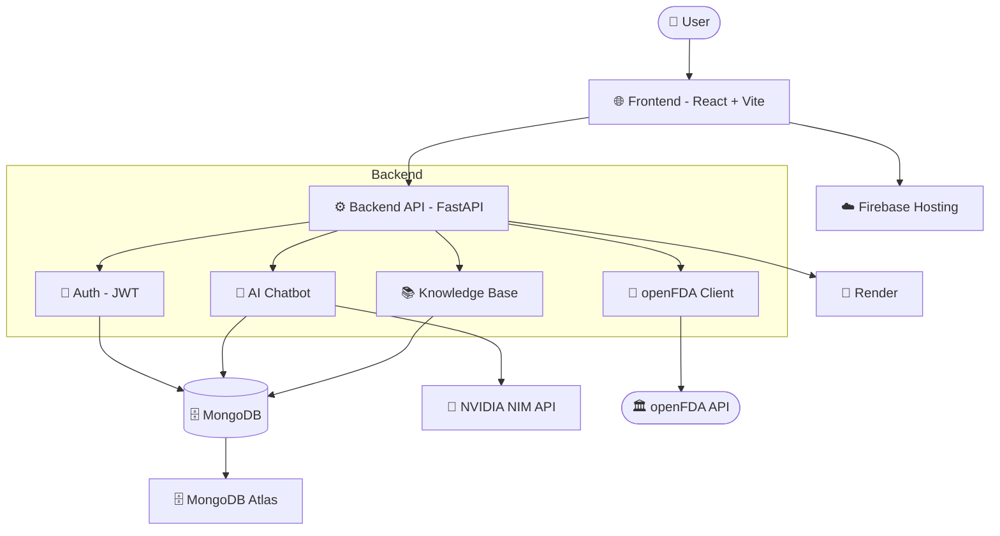

# Mendly — AI Medical Companion

[](LICENSE)
[](CONTRIBUTING.md)


**Mendly** is an AI-powered health information platform that helps users search medicines, check drug interactions, find nearby hospitals and pharmacies, and chat with an AI health assistant — all in one place.

> ⚠️ **Disclaimer:** This project is not a medical product and does not provide diagnosis, treatment, or professional medical advice. It is an experimental software project for informational purposes only.

---

## Table of Contents

- [Vision](#vision)
- [Core Features](#core-features)
- [Live Demo](#live-demo)
- [Technology Stack](#technology-stack)
- [Project Structure](#project-structure)
- [Quick Start](#quick-start)
- [Usage Guide](#usage-guide)
- [Deployment](#deployment)
- [Development](#development)
- [Contributing](#contributing)
- [License](#license)

---

## Vision

*"Empowering health decisions through AI — where information meets compassion."*

Mendly reimagines how people interact with health information. Most health apps either give you raw data without context or lock you into a single feature. Mendly bridges the gap — combining **AI conversation**, **drug databases**, **location-based care discovery**, and **personalized health tracking** into one seamless experience.

---

## Core Features

| Feature | Description |
|---------|-------------|
| 🤖 **Elix AI Chatbot** | Conversational AI that answers questions about diseases, symptoms, medicines, and interactions |
| 💊 **Medicine Search** | Browse FDA-approved drugs with uses, dosage, side effects, and precautions |
| 🩺 **Medical Conditions** | Disease profiles with symptoms, causes, treatment, and prevention info |
| ⚡ **Drug Interaction Checker** | Check two medicines for conflicts and adverse reactions |
| 🏥 **Nearby Hospitals** | Find healthcare facilities by search or current geolocation |
| 💊 **Nearby Pharmacies** | Locate pharmacies and medical stores near you |
| 🆘 **Emergency Contacts** | Country-wise emergency numbers with tap-to-call |
| 🔖 **Saved Items** | Bookmark medicines and conditions for quick reference |
| 🌓 **Dark/Light Theme** | Toggle between dark and light mode with persistent preference |

---

## Live Demo

| Service | URL |
|---------|-----|
| 🌐 **Frontend** | [https://mendlyapp.web.app](https://mendlyapp.web.app) |
| ⚙️ **Backend API** | [https://mendly-backend-0vyg.onrender.com](https://mendly-backend-0vyg.onrender.com) |
| 📖 **API Docs** | [https://mendly-backend-0vyg.onrender.com/docs](https://mendly-backend-0vyg.onrender.com/docs) |

---

## Architecture Flow



**How data flows:**
1. User visits **Mendlyapp** (Firebase Hosting)
2. Frontend calls **FastAPI backend** (Render)
3. Backend routes to: **Auth**, **Chatbot**, **openFDA**, or **Knowledge Base**
4. Chatbot queries **NVIDIA NIM** for AI responses
5. Data persists in **MongoDB Atlas**

---

## Technology Stack

### Frontend

| Layer | Technology |
|-------|-----------|
| ⚛️ Framework | **React 19** with **Vite 8** |
| 🔷 Language | **TypeScript 5** |
| 🎨 Styling | **Tailwind CSS v4** |
| 🧭 Routing | **React Router v7** |
| ⚡ Build | **Vite** (lightning-fast HMR) |

### Backend

| Layer | Technology |
|-------|-----------|
| 🐍 Framework | **FastAPI** (Python) |
| 🗄️ Database | **MongoDB** via Motor (async driver) |
| 🔐 Auth | JWT + bcrypt |
| 🤖 AI | **NVIDIA NIM** (Llama/DeepSeek models) |
| 📡 Data | **openFDA Drug Label API** |
| 🐳 Deployment | **Docker**-ready |

### Infrastructure

| Service | Purpose |
|---------|---------|
| ☁️ **Firebase Hosting** | Frontend static hosting + CDN |
| 🚀 **Render** | Backend API deployment |
| 🗄️ **MongoDB Atlas** | Cloud database |
| 🧠 **NVIDIA NIM** | AI model inference |

---

## Project Structure

```
mediguide/
├── frontend/                      # React + Vite SPA
│   ├── src/
│   │   ├── components/
│   │   │   ├── auth-modal.tsx     # Login/signup modal
│   │   │   ├── landing-page.tsx   # Marketing landing page
│   │   │   ├── Logo.tsx           # Brand logo component
│   │   │   └── ...
│   │   ├── pages/
│   │   │   ├── Home.tsx           # Landing page
│   │   │   ├── Dashboard.tsx      # User dashboard
│   │   │   ├── Chatbot.tsx        # AI chat interface
│   │   │   ├── Medicines.tsx      # Medicine search
│   │   │   ├── Conditions.tsx     # Disease browser
│   │   │   ├── Hospitals.tsx      # Nearby hospitals
│   │   │   ├── Pharmacies.tsx     # Nearby pharmacies
│   │   │   ├── Emergency.tsx      # Emergency contacts
│   │   │   ├── Saved.tsx          # Bookmarks
│   │   │   └── Account.tsx        # Profile management
│   │   └── lib/
│   │       ├── config.ts          # API base URL config
│   │       ├── api.ts             # Fetch helpers
│   │       └── auth-context.tsx   # Auth state management
│   ├── public/
│   ├── dist/                      # Production build → Firebase
│   ├── firebase.json
│   ├── .firebaserc
│   ├── vite.config.ts
│   └── package.json
│
├── backend/                       # FastAPI backend
│   ├── app/
│   │   ├── main.py                # Routes, middleware, CORS
│   │   ├── auth.py                # JWT, password hashing, OAuth
│   │   ├── schemas.py             # Pydantic models
│   │   ├── database.py            # MongoDB connection (Motor)
│   │   ├── chatbot.py             # AI chatbot engine
│   │   ├── knowledge_base.py      # Curated disease/drug data
│   │   ├── openfda_client.py      # openFDA API client
│   │   └── __init__.py
│   ├── Dockerfile                 # Containerized deployment
│   ├── .dockerignore
│   ├── render.yaml                # Render deployment config
│   ├── requirements.txt
│   └── .env.example
│
├── scripts/                       # Utility scripts
├── package.json                   # Root workspace scripts
└── README.md
```

---

## Quick Start

### Prerequisites

- **Node.js 18+** — [Download](https://nodejs.org/)
- **Python 3.12+** — [Download](https://www.python.org/)
- **MongoDB** — [MongoDB Atlas](https://www.mongodb.com/atlas) (free tier)
- **NVIDIA API Key** — [build.nvidia.com](https://build.nvidia.com)

### Installation

#### 1. Clone the Repository

```bash
git clone https://github.com/Satendra90390/Mendly.git
cd Mendly
```

#### 2. Backend Setup

```bash
cd backend
python -m venv .venv

# Windows
.venv\Scripts\activate
# macOS/Linux
# source .venv/bin/activate

pip install -r requirements.txt
cp .env.example .env
# Edit .env with your MongoDB URI, JWT secret, and NVIDIA API key
uvicorn app.main:app --reload --port 8002
```

API docs available at: `http://localhost:8002/docs`

#### 3. Frontend Setup

```bash
cd frontend
npm install
npm run dev
```

Open **http://localhost:3000**. The frontend auto-detects localhost and connects to `http://localhost:8002/api`.

---

## Usage Guide

### First-Time Experience

1. **Create an account** — Sign up with email and password (no credit card needed)
2. **Explore the dashboard** — View health tips, stats, and quick actions
3. **Chat with Elix** — Ask health-related questions in natural language
4. **Search medicines** — Look up drugs by name, condition, or symptoms
5. **Find nearby care** — Enable location to discover hospitals and pharmacies

### Key Interactions

| Feature | How to Use |
|---------|-----------|
| 💬 **AI Chat** | Navigate to Elix and type your health question |
| 💊 **Medicine Search** | Use the Medicines page to search by name or condition |
| ⚡ **Interaction Checker** | Select two medicines to check for conflicts |
| 🏥 **Nearby Care** | Go to Hospitals or Pharmacies and enable location |
| 🆘 **Emergency** | View country-wise emergency numbers with one-tap call |
| 🔖 **Saved Items** | Bookmark medicines/conditions for quick access |

---

## Deployment

### Frontend (Firebase Hosting)

```bash
cd frontend
npm run build
firebase deploy --only hosting
```

### Backend (Render)

1. Push repo to GitHub
2. On [Render](https://render.com): **New > Web Service**, select repo, root directory `backend`
3. Set environment variables in Render Dashboard:

| Variable | Value |
|----------|-------|
| `MONGODB_URI` | Your MongoDB Atlas connection string |
| `JWT_SECRET` | `python -c "import secrets; print(secrets.token_hex(32))"` |
| `FRONTEND_ORIGINS` | `https://mendlyapp.web.app,https://mendlyapp.firebaseapp.com` |
| `FRONTEND_URL` | `https://mendlyapp.web.app` |
| `NVIDIA_API_KEY` | Your NVIDIA NIM API key |
| `CHATBOT_PROVIDER` | `nvidia` |

---

## Development

### Available Scripts

| Command | Description |
|---------|-------------|
| `npm run dev` | Start Vite dev server (port 3000) |
| `npm run build` | Production build → `frontend/dist/` |
| `npm run preview` | Preview production build locally |
| `npm run build:prod` | Build Tailwind CSS for production |

### Environment Variables

```env
# Backend (.env)
MONGODB_URI=mongodb+srv://...
JWT_SECRET=your-32-char-secret
FRONTEND_ORIGINS=http://localhost:3000,https://mendlyapp.web.app
FRONTEND_URL=http://localhost:3000
NVIDIA_API_KEY=your-key
CHATBOT_PROVIDER=nvidia
PORT=8002
```

### Code Style

- **Frontend**: TypeScript, React functional components, Tailwind CSS
- **Backend**: Python FastAPI, async/await, Pydantic schemas
- **No Axios**: Native `fetch()` API used throughout

---

## Contributing

We welcome contributions from developers, healthcare professionals, and AI enthusiasts!

1. **Fork** the repository
2. Create a feature branch: `git checkout -b feature/amazing-feature`
3. **Commit** your changes: `git commit -m 'Add amazing feature'`
4. **Push** to the branch: `git push origin feature/amazing-feature`
5. Open a **Pull Request**

### Guidelines

- 🔒 **Security**: No hardcoded secrets or API keys
- 🧪 **Testing**: Verify your changes work locally
- 📚 **Docs**: Update README for new features
- 🎨 **UI/UX**: Follow existing design patterns

---

## License

**MIT License** — Free to use, modify, and distribute.

Copyright (c) 2025 Mendly

---

## Support

| Type | Contact |
|------|---------|
| 🐛 Bug Reports | [GitHub Issues](https://github.com/Satendra90390/Mendly/issues) |
| 💡 Feature Requests | [GitHub Discussions](https://github.com/Satendra90390/Mendly/discussions) |

---

> *"Technology should serve humanity's deepest needs — health and well-being are fundamental."* 🌟
