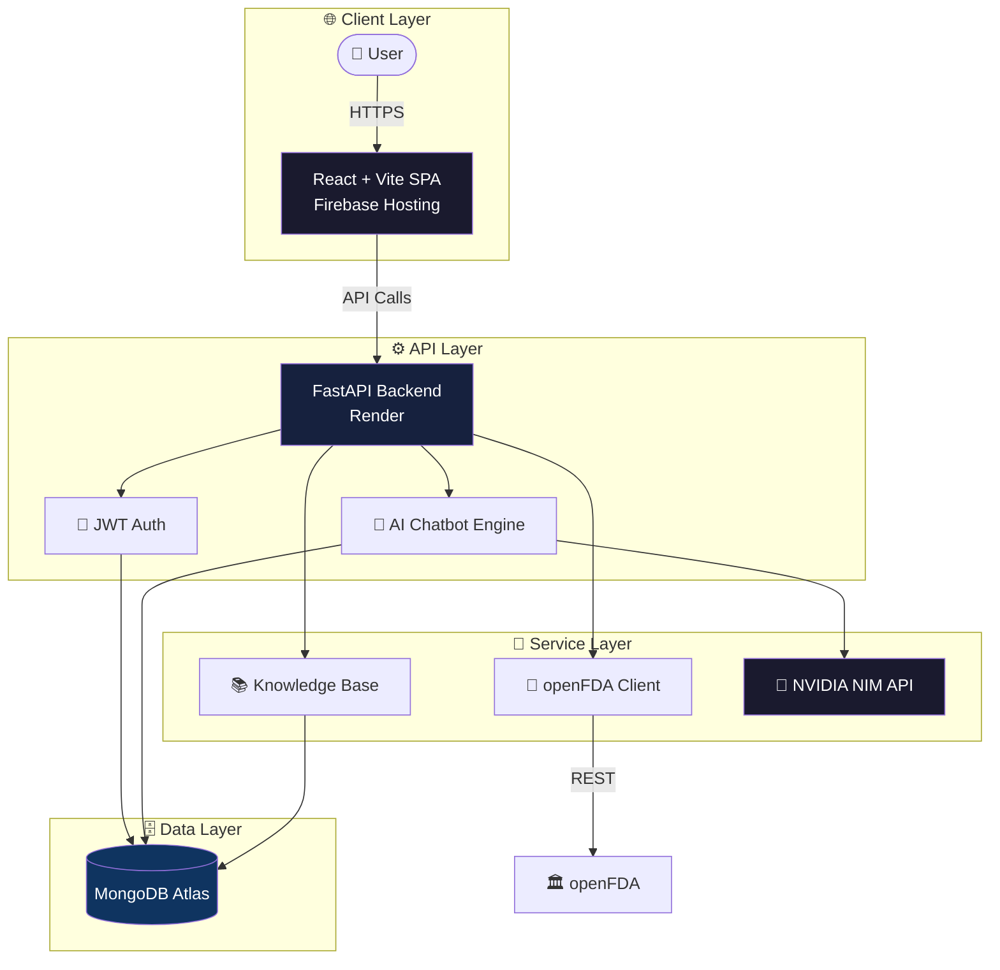
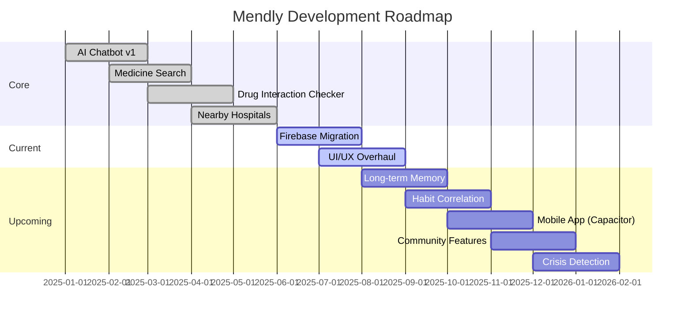
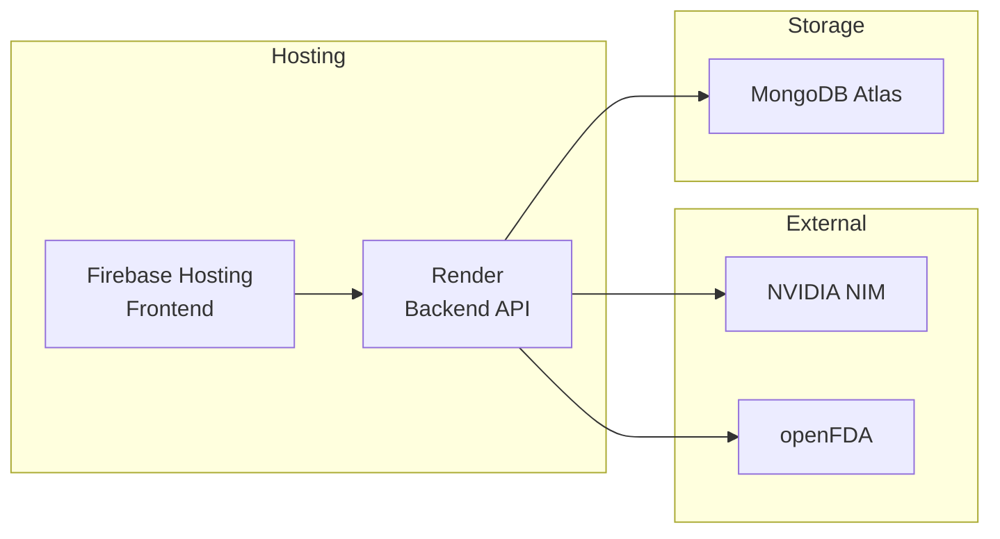
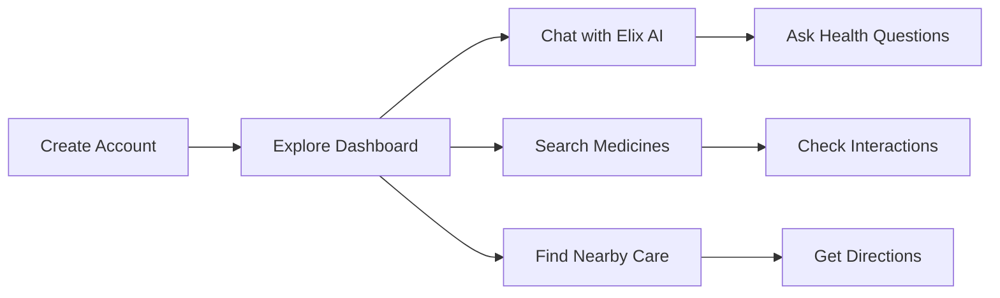
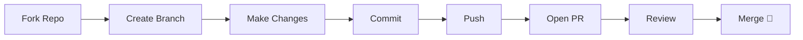

<div align="center">

# Mendly — AI Medical Companion

[](LICENSE)
[](CONTRIBUTING.md)


**Empowering health decisions through AI — where information meets compassion.**

> ⚠️ **Disclaimer:** Mendly is an experimental software project for informational purposes only. It does **not** provide medical diagnosis, treatment, or professional healthcare advice.

</div>

---

## 📋 Table of Contents

- [🌟 Vision](#-vision)
- [✨ Core Features](#-core-features)
- [🖥️ Live Demo](#️-live-demo)
- [🏗️ System Architecture](#️-system-architecture)
- [🧠 AI Model](#-ai-model)
- [🗺️ Roadmap](#️-roadmap)
- [🛠️ Technology Stack](#️-technology-stack)
- [📁 Project Structure](#-project-structure)
- [🚀 Quick Start](#-quick-start)
- [📖 Usage Guide](#-usage-guide)
- [📦 Deployment](#-deployment)
- [🔧 Development](#-development)
- [🤝 Contributing](#-contributing)
- [📄 License](#-license)

---

## 🌟 Vision

Mendly reimagines how people interact with health information. Most health apps either give you raw data without context or lock you into a single feature. Mendly bridges the gap — combining **AI conversation**, **drug databases**, **location-based care discovery**, and **personalized health tracking** into one seamless experience.

### Why Mendly?

| Problem | Solution |
|---------|----------|
| ❓ Hard to find reliable health info fast | 🤖 AI chatbot answers questions instantly |
| 💊 No easy way to check drug interactions | ⚡ Interaction checker with FDA data |
| 🏥 Can't find nearby care in emergencies | 📍 Location-based hospital & pharmacy finder |
| 📚 Scattered health bookmarks | 🔖 Save & organize medicines and conditions |
| 🌍 Different emergency numbers per country | 🆘 Country-wise emergency contacts with tap-to-call |

---

## ✨ Core Features

| Feature | Description |
|:--------|:------------|
| 🤖 **Elix AI Chatbot** | Conversational AI that answers questions about diseases, symptoms, medicines, and interactions |
| 💊 **Medicine Search** | Browse FDA-approved drugs with uses, dosage, side effects, and precautions |
| 🩺 **Medical Conditions** | Disease profiles with symptoms, causes, treatment, and prevention info |
| ⚡ **Drug Interaction Checker** | Check two medicines for conflicts and adverse reactions |
| 🏥 **Nearby Hospitals** | Find healthcare facilities by search or current geolocation |
| 💊 **Nearby Pharmacies** | Locate pharmacies and medical stores near you |
| 🆘 **Emergency Contacts** | Country-wise emergency numbers with tap-to-call |
| 🔖 **Saved Items** | Bookmark medicines and conditions for quick reference |
| 🌓 **Dark/Light Theme** | Toggle between dark and light mode with persistent preference |
| 🔐 **User Authentication** | Secure signup/login with JWT-based auth |

---

## 🖥️ Live Demo

| Service | URL |
|:--------|:----|
| 🌐 **Frontend** | [https://mendlyapp.web.app](https://mendlyapp.web.app) |
| ⚙️ **Backend API** | [https://mendly-backend-0vyg.onrender.com](https://mendly-backend-0vyg.onrender.com) |
| 📖 **API Documentation** | [https://mendly-backend-0vyg.onrender.com/docs](https://mendly-backend-0vyg.onrender.com/docs) |

---

## 🏗️ System Architecture



### Data Flow

```
User → Firebase Hosting (CDN) → FastAPI Backend → Services (NVIDIA NIM, openFDA) → MongoDB Atlas
```

---

## 🧠 AI Model

| Attribute | Detail |
|:----------|:-------|
| **Provider** | [NVIDIA NIM](https://build.nvidia.com) |
| **Models** | Llama 3.3 Nemotron, DeepSeek variants |
| **Purpose** | Health Q&A, symptom guidance, medicine info, emotional support |
| **Prompt Strategy** | System-prompted with medical disclaimer, context-aware memory |
| **Fallback** | Knowledge base for offline/common queries |
| **Temperature** | 0.3 (factual) — 0.7 (conversational) |

### How the AI Works

1. **User sends a message** via the chat interface
2. **Context is assembled** — conversation history + user profile + relevant knowledge base entries
3. **Prompt is constructed** with system instructions (role, boundaries, disclaimer)
4. **NVIDIA NIM API** is called with the assembled prompt
5. **Response is streamed** back to the user in real-time
6. **Conversation is saved** to MongoDB for continuity

> 🧪 The model is prompt-engineered to stay within health-information boundaries and never provide diagnoses.

---

## 🗺️ Roadmap



### ✅ Completed
- [x] AI chatbot with NVIDIA NIM integration
- [x] Medicine search via openFDA API
- [x] Drug interaction checker
- [x] Nearby hospitals & pharmacies (geolocation)
- [x] Emergency contacts database
- [x] Saved items / bookmarks
- [x] Dark/light theme toggle
- [x] JWT authentication system

### 🔄 In Progress
- [ ] Firebase Hosting migration
- [ ] UI/UX redesign (modern, responsive)
- [ ] Performance optimization

### 📅 Planned
- [ ] Long-term conversation memory (summarization)
- [ ] Habit & mood correlation detection
- [ ] Mobile app (Capacitor)
- [ ] Anonymous community discussions
- [ ] Crisis detection & escalation system
- [ ] Offline mode (PWA)
- [ ] Multi-language support

---

## 🛠️ Technology Stack

### Frontend

| Layer | Technology | Purpose |
|:------|:-----------|:--------|
| ⚛️ Framework | **React 19** | Component-based UI |
| ⚡ Build | **Vite 8** | Lightning-fast HMR & builds |
| 🔷 Language | **TypeScript 5** | Type safety |
| 🎨 Styling | **Tailwind CSS v4** | Utility-first CSS |
| 🧭 Routing | **React Router v7** | Client-side navigation |
| 🎭 UI Primitives | **Radix UI / Shadcn** | Accessible components |
| ☁️ Hosting | **Firebase Hosting** | Global CDN + SSL |

### Backend

| Layer | Technology | Purpose |
|:------|:-----------|:--------|
| 🐍 Framework | **FastAPI** (Python) | Async API server |
| 🗄️ Database | **MongoDB + Motor** | Async document store |
| 🔐 Auth | **JWT + bcrypt** | Secure authentication |
| 🤖 AI | **NVIDIA NIM API** | LLM inference |
| 📡 External API | **openFDA** | Drug label data |
| 🐳 Container | **Docker** | Reproducible deployment |
| 🚀 Hosting | **Render** | Backend API hosting |

### Infrastructure



---

## 📁 Project Structure

```
mediguide/
├── frontend/                          # React + Vite SPA
│   ├── src/
│   │   ├── components/                # Reusable UI components
│   │   │   ├── auth-modal.tsx         # Login/signup modal
│   │   │   ├── landing-page.tsx       # Marketing landing page
│   │   │   └── ...
│   │   ├── pages/                     # Route pages
│   │   │   ├── Home.tsx               # Landing page
│   │   │   ├── Dashboard.tsx          # User dashboard
│   │   │   ├── Chatbot.tsx            # AI chat interface
│   │   │   ├── Medicines.tsx          # Medicine search
│   │   │   ├── Conditions.tsx         # Disease browser
│   │   │   ├── Hospitals.tsx          # Nearby hospitals
│   │   │   ├── Pharmacies.tsx         # Nearby pharmacies
│   │   │   ├── Emergency.tsx          # Emergency contacts
│   │   │   ├── Saved.tsx              # Bookmarks
│   │   │   └── Account.tsx            # Profile management
│   │   └── lib/                       # Shared utilities
│   │       ├── config.ts              # API base URL config
│   │       ├── api.ts                 # Fetch helpers
│   │       └── auth-context.tsx       # Auth state management
│   ├── public/                        # Static assets
│   ├── dist/                          # Production build → Firebase
│   ├── firebase.json
│   ├── .firebaserc
│   └── package.json
│
├── backend/                           # FastAPI backend
│   ├── app/
│   │   ├── main.py                    # Routes, middleware, CORS
│   │   ├── auth.py                    # JWT, password hashing
│   │   ├── schemas.py                 # Pydantic models
│   │   ├── database.py                # MongoDB connection (Motor)
│   │   ├── chatbot.py                 # AI chatbot engine
│   │   ├── knowledge_base.py          # Curated disease/drug data
│   │   └── openfda_client.py          # openFDA API client
│   ├── Dockerfile
│   ├── render.yaml
│   ├── requirements.txt
│   └── .env.example
│
├── scripts/
├── package.json
└── README.md
```

---

## 🚀 Quick Start

### Prerequisites

| Requirement | Version | Link |
|:------------|:--------|:-----|
| Node.js | 18+ | [Download](https://nodejs.org/) |
| Python | 3.12+ | [Download](https://www.python.org/) |
| MongoDB | Atlas (free) | [Sign Up](https://www.mongodb.com/atlas) |
| NVIDIA API Key | — | [Get Key](https://build.nvidia.com) |

### Installation

#### 1. Clone the Repository

```bash
git clone https://github.com/Satendra90390/Mendly.git
cd Mendly
```

#### 2. Backend Setup

```bash
cd backend
python -m venv .venv

# Windows
.venv\Scripts\activate
# macOS/Linux
# source .venv/bin/activate

pip install -r requirements.txt
cp .env.example .env
# Edit .env with your MongoDB URI, JWT secret, and NVIDIA API key

uvicorn app.main:app --reload --port 8002
```

> 📖 API docs auto-generated at: `http://localhost:8002/docs`

#### 3. Frontend Setup

```bash
cd frontend
npm install
npm run dev
```

> 🌐 Open **http://localhost:3000** — frontend auto-detects localhost and connects to the backend.

---

## 📖 Usage Guide

### First-Time Experience



1. **🔐 Create an account** — Sign up with email & password (free)
2. **📊 Explore the dashboard** — Health tips, stats, and quick actions
3. **💬 Chat with Elix** — Ask health-related questions in natural language
4. **💊 Search medicines** — Look up drugs by name, condition, or symptoms
5. **📍 Find nearby care** — Enable location to discover hospitals and pharmacies

### Key Features at a Glance

| Feature | Location | How to Use |
|:--------|:---------|:-----------|
| 💬 **AI Chat** | `/chat` or sidebar | Type your health question |
| 💊 **Medicines** | `/medicines` | Search by name or condition |
| ⚡ **Interactions** | `/medicines` → Checker tab | Select two drugs |
| 🏥 **Hospitals** | `/hospitals` | Enable location or search |
| 🆘 **Emergency** | `/emergency` | Select country → tap to call |
| 🔖 **Saved** | `/saved` | Bookmark from any medicine/condition page |

---

## 📦 Deployment

### Frontend → Firebase Hosting

```bash
cd frontend
npm run build
firebase deploy --only hosting
```

> Pushes `dist/` to Firebase CDN — **https://mendlyapp.web.app**

### Backend → Render

1. Push repo to GitHub
2. On [Render](https://render.com): **New > Web Service**
3. Connect repo, set root directory = `backend`
4. Add these environment variables:

| Variable | Value |
|:---------|:------|
| `MONGODB_URI` | `mongodb+srv://<user>:<pass>@cluster.xxxxx.mongodb.net` |
| `JWT_SECRET` | `python -c "import secrets; print(secrets.token_hex(32))"` |
| `FRONTEND_ORIGINS` | `https://mendlyapp.web.app,https://mendlyapp.firebaseapp.com` |
| `FRONTEND_URL` | `https://mendlyapp.web.app` |
| `NVIDIA_API_KEY` | `nvapi-...` |
| `CHATBOT_PROVIDER` | `nvidia` |

---

## 🔧 Development

### Available Scripts

| Command | Description |
|:--------|:------------|
| `npm run dev` | 🔥 Start Vite dev server (port 3000) |
| `npm run build` | 📦 Production build → `frontend/dist/` |
| `npm run preview` | 👁️ Preview production build locally |
| `npm run build:prod` | 🎨 Build Tailwind CSS for production |

### Environment Variables

```env
# Backend (.env)
MONGODB_URI=mongodb+srv://...
JWT_SECRET=your-32-char-secret
FRONTEND_ORIGINS=http://localhost:3000,https://mendlyapp.web.app
FRONTEND_URL=http://localhost:3000
NVIDIA_API_KEY=nvapi-...
CHATBOT_PROVIDER=nvidia
PORT=8002
```

### Code Conventions

| Area | Convention |
|:-----|:-----------|
| **Frontend** | TypeScript, React functional components, Tailwind classes |
| **Backend** | Python FastAPI, async/await, Pydantic validation |
| **HTTP** | Native `fetch()` — no Axios |
| **Auth** | JWT in `Authorization: Bearer <token>` header |
| **API Format** | JSON request/response, RESTful routes |

---

## 🤝 Contributing

We welcome contributions from developers, healthcare professionals, and AI enthusiasts!



### Guidelines

| Principle | Guideline |
|:----------|:----------|
| 🔒 **Security** | Never commit secrets or API keys |
| 🧪 **Testing** | Verify changes locally before PR |
| 📚 **Documentation** | Update README for new features |
| 🎨 **UI/UX** | Follow existing component patterns |
| 📝 **Commits** | Use clear, descriptive commit messages |

---

## 📄 License

**MIT License** — Free to use, modify, and distribute.

Copyright © 2025 Mendly

---

<div align="center">

**Built with ❤️ using React, FastAPI & NVIDIA NIM**

[🐛 Report Bug](https://github.com/Satendra90390/Mendly/issues) · [💡 Request Feature](https://github.com/Satendra90390/Mendly/discussions)

</div>
